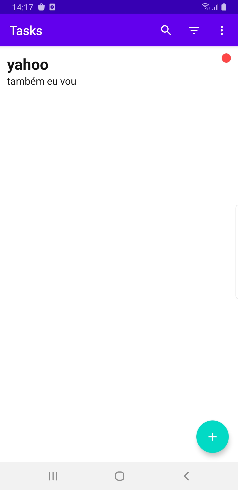
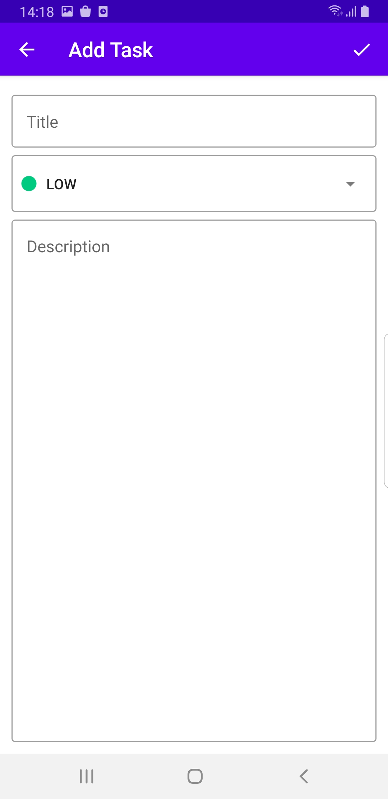
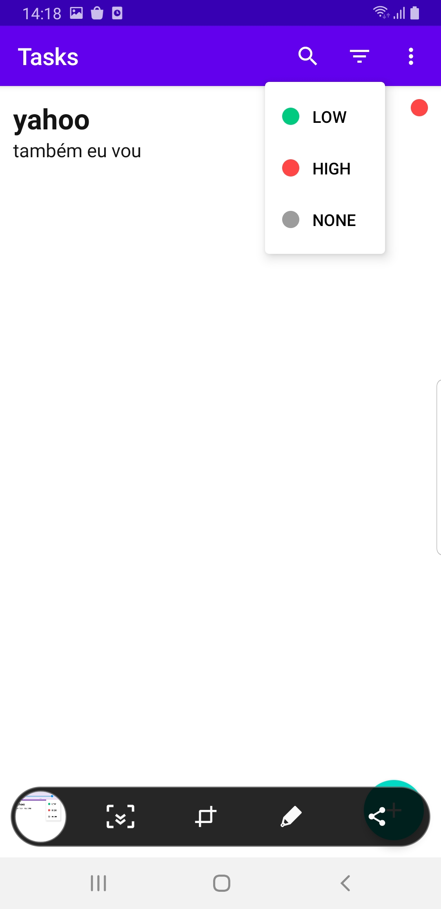

# Daedalus-Scheduler
To-Do App using Modern Declarative UI Toolkit called Jetpack Compose

## The Brief

App that allows user to create notes

## Architecture & Libraries
    - States in Jetpack Compose
    - Side Effects
    - ROOM Database
    - Compose Navigation
    - Dependency Injection with Dagger-Hilt
    - Preferences DataStore
    - Support for Dark and Light Themes
    - Animate UI Components
    - Animated Splash Screen
    - Swipe to Delete Animation
    - Clean Architecture
    - MVVM
    - Transition Animations

## App preview:

Image #1            |  Image #2             |  Image #3           
:-------------------------:|:----------------------------:|:----------------------------:
    |       |   
